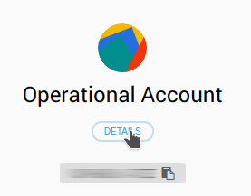
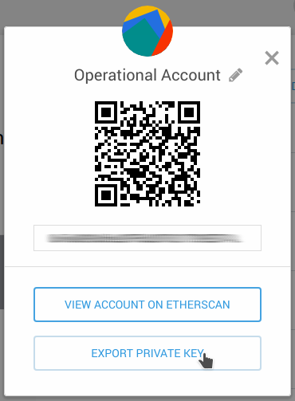
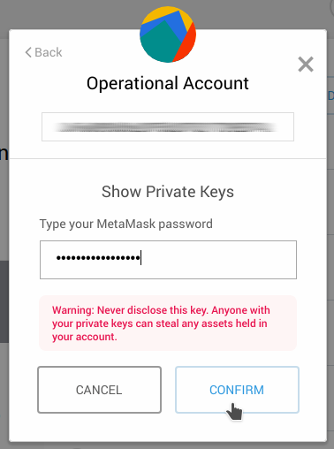
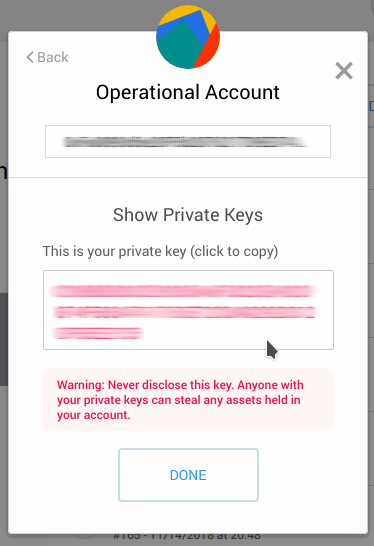

# ICT Ministry's Digital Innovation Center Blockchain Toolkit API

Welcome to the Blockchain Toolkit API. This is the documentation for developers to start using this toolkit.

The toolkit was developed in order to tackle three use cases: a) Uploading a document, b) Verifying a document authenticity, and c) Downloading a document via it's hash.

In order to start the example you must clone this repository and other two *in the same folder* (i.e. the three repositories *must* live under the same containing folder).

Cloning order:

1. [Toolkit SmartContracts Repository](https://github.com/centrodeinnovacion/contracts)
1. [Toolkit API Repository](https://github.com/centrodeinnovacion/api)
1. [Toolkit Frontend Sample Repository](https://github.com/centrodeinnovacion/frontend)

So, go into each one in the specified order and follow the instructions to deploy. We highly recommend to deploy locally first using the **NPM Method**, then deploying locally using the **Docker Method**, and finally deploying to production using the **Production Method**.

## Environment
For this project to work there must be a `.env` file with the following content (no matter which method you choose to deploy), all the data must be provided by whoever is using it:
```
contractAddress=0x6162c82b4ae5108a464425caee41a5cd29f81f6e
mnemonic=d7b34edc31aeeb66a4b7356c6270034e397a1bb9e8641f7b2c584ad9699bb12b
account=0xd01f1c5af9648378288839d59d6f09b8c6109130
host=http://localhost:8545
pin=true
```

1. `contractAddress`: The address where the contract was deployed. It's expected from you to bring that information from the Contracts project.
1. `mnemonic`: The private key of the signing account (the owner of the account must provide this information). There is more info about how to [Get the Private Key](#get-the-private-key)
1. `account`: The signing account address (i.e. the account used to deploy the SmartContract).
1. `host`: The blockchain access point node endpoint address (it must include port and API key if needed). You can use the INFURA host as shown in the Contracts project.
1. `pin`: Optional. If present, must be set to `true`. Indicates whether or not the uploaded file is pinned into the IPFS network.

### Get the Private Key
#### Locally
If you are running `ganache-cli`, once you start, you'll see a first list pointing to the ten addresses. Then a second list points the respective private keys for the addresses. Copy the first private key.

#### Metamask
In the other hand, if you want to point to a SmartContract deployed at Ropsten, or any other Ethereum network, and you created the deployment account using Metamask, you can click on Details button below the avatar an account name.



It will show a details box. Then click on the Export Private Key button.



Type your password, and click on the Confirm button.



The private key will show up.



## Container
This project has been dockerized. To run you must have [Docker installed](https://docs.docker.com/install/), as well as [docker-compose](https://docs.docker.com/compose/install/).

You must have your user added into the docker users group, so you can run the following commands, otherwise, you will have to precede the command `sudo`.

```bash
docker-compose up
```

## Postman
This project has a postman environment, so all the request are done against `BasePath`. There is also a collection using this environment name. You can import them from the `postman` folder.