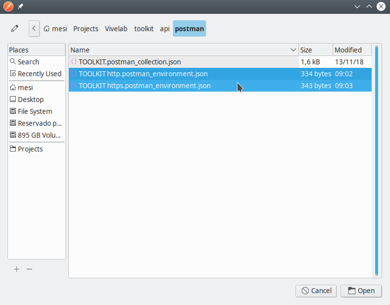

# ICT Ministry's Digital Innovation Center Blockchain Toolkit API

Welcome to the Blockchain Toolkit API. This is the documentation for developers to start using this toolkit.

The toolkit was developed in order to tackle three use cases: a) Uploading a document, b) Verifying a document authenticity, and c) Downloading a document via its hash.

In order to start the example you must clone this repository and other two *in the same folder* (i.e. the three repositories *must* live under the same containing folder).

Cloning order:

1. [Toolkit SmartContracts Repository](https://github.com/centrodeinnovacion/contracts)
1. [Toolkit API Repository](https://github.com/centrodeinnovacion/api)
1. [Toolkit Frontend Sample Repository](https://github.com/centrodeinnovacion/frontend)

So, go into each one in the specified order and follow the instructions to deploy. We highly recommend to deploy locally first using the **[NPM Method](#npm-method)**, then deploying locally using the **[Docker Method](#docker-method)**, and finally deploying to production using the **[Production Method](#production-method)**.

## Environment
For this project to work there must be a `.env` file with the following content (no matter which method you choose to deploy), all the data must be provided by whoever is using it:

```
contractAddress=0x6162c82b4ae5108a464425caee41a5cd29f81f6e
mnemonic=d7b34edc31aeeb66a4b7356c6270034e397a1bb9e8641f7b2c584ad9699bb12b
account=0xd01f1c5af9648378288839d59d6f09b8c6109130
host=http://localhost:8545
pin=true
```

1. `contractAddress`: The address where the contract was deployed. It's expected from you to bring that information from the Contracts project.
1. `mnemonic`: The private key of the signing account (the owner of the account must provide this information). There is more info about how to [Get the Private Key](#get-the-private-key)
1. `account`: The signing account address (i.e. the account used to deploy the SmartContract).
1. `host`: The blockchain access point node endpoint address (it must include port and API key if needed). You can use the INFURA host as shown in the Contracts project.
1. `pin`: Optional. If present, must be set to `true`. Indicates whether or not the uploaded file is pinned into the IPFS network.

### Get the Private Key
#### Locally
If you are running `ganache-cli`, once you start, you'll see a first list pointing to the ten addresses. Then a second list points the respective private keys for the addresses. Copy the first private key.

#### Metamask
In the other hand, if you want to point to a SmartContract deployed at Ropsten, or any other Ethereum network, and you created the deployment account using Metamask, you can click on Details button below the avatar an account name.


It will show a details box. Then click on the Export Private Key button.


Type your password, and click on the Confirm button.


The private key will show up.


## Deployment
This section shows the different ways to start up the project. Don't forget for this step to work you must have created the `.env` file as shown at [Environment](#environment) section.

### NPM Method
This is the preferred method to start up the API when developing, since it has the hot reload listening to any change on the code.

Ensure you have all the dependencies installed.

```bash
npm i
```

Once the dependencies are installed, just run the project.

```bash
npm start
```

You will see the API throws a message saying it can not find the private key, so it will serve at [http://localhost:10010](http://localhost:10010).

#### Postman
A Postman collection and two Postman environments have been included into this project, so developers can test against the recently started up API project.

You must first have to import the collection.


Select the file at `postman/TOOLKIT.postman_collection.json`.


Once the collection has been imported, you must import the two environment files (Click on the cog icon as the mouse pointer in the image shows).


Click on the import button.


Then click on the choose files button.


Select both environment files at once.



On the Environment selector you can use any of the imported environments. In this case, use the TOOLKIT http environment.


On the Collections area, you can see the TOOLKIT folder, expand it and use any of its operations. For instance, in the image the Upload a file operation was selected. You only have to click on the Body section and choose any file. Then fire up the execution clicking on the Send button.


### Swagger
Install Swagger globally as follows:

```bash
npm i -g swagger
```

Developers can go into the official API documentation executing in another console (the API is supposed to be running), the following command.

```bash
swagger project edit
```

A new tab will be opened on your default browser.


The editor will show the different endpoint alongside with their parameters and expected responses. It also can be used to fire up requests to the API.


### Docker Method
This API project also comes with a Docker configuration configured to allow connections through SSL on port 10443. To start it up, type the following command.

You must have both [Docker](https://docs.docker.com/install/) and [Docker Compose](https://docs.docker.com/compose/install/) installed on you machine.

```bash
docker-compose up
```

The API Project does provide self signed (not valid ones) certificates to allow Docker find them as stated on the `docker-compose.yml` file.

In order to test this using Postman, refer to the [Postman](#postman) section. Just change the environment to TOOLKIT https.

### Production Method
For your convenience, there is a prepared image at [ViveLab Bogota's Docker Hub Account](https://hub.docker.com/r/vivelabbogota/toolkit-api/). Just pick the version that fits better. We highly recommend to use the v1.0.0 as the time this documentation is written.

It's worthy to mention that on production you should use a `.env` file fully dedicated to that environment. You also need to provide valid SSL certificates for the API to work properly. It is not recommended to use self signed certificates.

## Disclaimer
We are responsible for neither the use you give to this toolkit nor the deployment on production environments. The software is delivered as it is and you are compelled to use it as shown here.